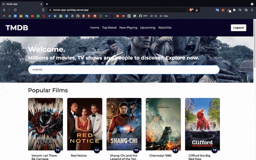

# Movie App



---

### Demo

Online deployment of this project is available at [Movie App](https://movie-app.ayktldg.vercel.app/).

You can use the below credentials to test the app.

```
email: johndoe@gmail.com
username: johndoe
password: 1234test
```

### Technologies

Vue, Vuex, Vue-Router, Axios, Bootstrap, uuid, Tmdb Api

### Features

- Listing movies according to their features
- Movie search
- Viewing movie detail
- Watching the movie trailer
- Saving and removing movies to watch list for logged in users

## Project setup

```
yarn install
```

### Compiles and hot-reloads for development

```
yarn serve
```

### Compiles and minifies for production

```
yarn build
```

### Lints and fixes files

```
yarn lint
```

### Customize configuration

See [Configuration Reference](https://cli.vuejs.org/config/).
